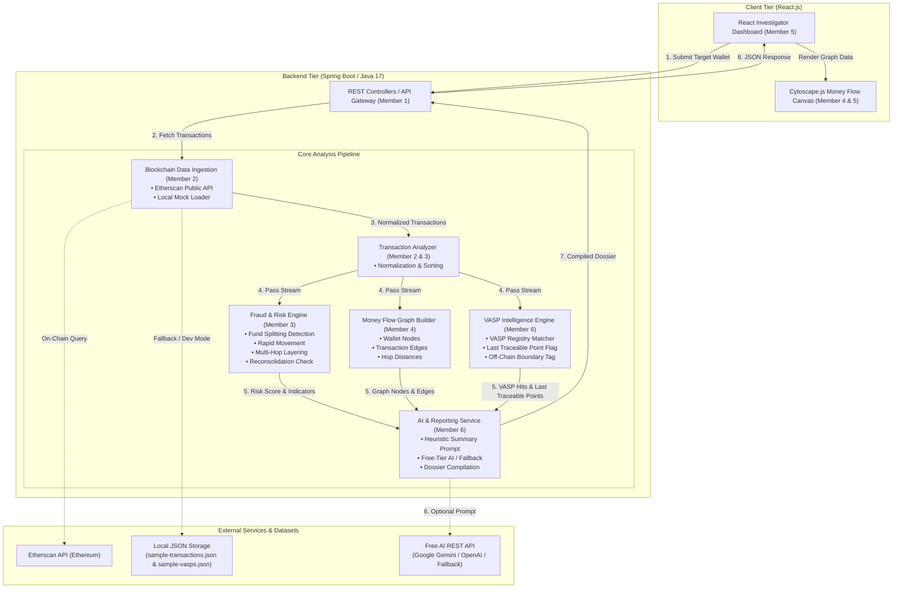

# System Architecture: Crypto Fraud & VASP Intelligence

This document defines the high-level system architecture, component boundaries, data flow, and core design principles for the **Crypto Fraud & VASP Intelligence** prototype.

---

## 1. High-Level Architecture Overview

The system operates as an **investigation assistant pipeline** designed to ingest on-chain transaction data, extract money-movement patterns, evaluate heuristic risk signals, identify Virtual Asset Service Provider (VASP) boundaries, and render an interactive visualization and narrative summary for human investigators.



---

## 2. Component Breakdown & Team Ownership

### 2.1 API Gateway & Integration (`Member 1 - Team Lead`)
- **Package:** `com.cryptofraud.controller`
- **Role:** Exposes clean REST endpoints to the frontend, coordinates inter-service calls, enforces input validation (e.g., valid Ethereum address format `^0x[a-fA-F0-9]{40}$`), handles global error responses, and manages CORS.

### 2.2 Blockchain Data Ingestion (`Member 2 - Blockchain Engineer`)
- **Package:** `com.cryptofraud.service.blockchain`
- **Role:** Fetches raw transaction records for a given target address.
- **Data Sources:**
  - *Live Mode:* Etherscan Public API (`account&action=txlist`).
  - *Dev / Mock Mode:* Reads from `data/sample-transactions.json`.
- **Normalization:** Converts hex values, standardizes timestamps into ISO-8601 (`YYYY-MM-DDTHH:mm:ssZ`), and normalizes amounts to standard ETH decimal floats.

### 2.3 Fraud & Risk Engine (`Member 3 - Fraud / Risk Engineer`)
- **Package:** `com.cryptofraud.service.risk`
- **Role:** Analyzes the chronological transaction graph to detect signature money-laundering heuristics:
  - **Fund Splitting:** One source address sending to 3+ destination addresses within a narrow timeframe (+20 pts).
  - **Rapid Movement:** Incoming funds moved outbound within < 15 minutes (+20 pts).
  - **Multi-Hop Layering:** Funds passed through 3 or more intermediate wallets (+15 pts).
  - **Flagged Address Interaction:** Direct transaction involving a known fraudulent address (+20 pts).
  - **VASP Deposit:** Funds dispatched directly to a custodial exchange (+15 pts).
  - **Unusual Amount:** High volume spike relative to wallet history (+10 pts).
- **Output:** Explainable risk score (0–100) with a list of triggered risk factors.

### 2.4 Money Flow Graph Engine (`Member 4 - Graph Engineer`)
- **Package:** `com.cryptofraud.service.graph` (Backend) / Cytoscape Component (Frontend)
- **Role:** Transforms tabular transaction records into a directed graph structure:
  - **Nodes:** Represent unique wallet addresses (annotated with role: `target`, `victim`, `scam`, `hop`, `vasp`).
  - **Edges:** Represent transactions with properties (`amount`, `asset`, `hash`, `timestamp`, `rapidMovementFlag`).
- **Compatibility:** Strictly compatible with **Cytoscape.js** / **React Flow** data formats.

### 2.5 Frontend Dashboard (`Member 5 - Frontend Engineer`)
- **Directory:** `frontend/react-project/src/`
- **Role:** User interface for security analysts:
  - Search bar accepting Ethereum addresses or selecting preset demo wallets.
  - Heuristic risk gauge (Low 0–30, Medium 31–60, High 61–80, Critical 81–100).
  - Interactive Money Flow Canvas (pan, zoom, node inspection).
  - Detailed transaction ledger with search and filtering.
  - VASP Intelligence notification banner.

### 2.6 VASP Intelligence & AI Reporting (`Member 6 - VASP + AI Engineer`)
- **Package:** `com.cryptofraud.service.vasp` & `com.cryptofraud.service.report`
- **Role:**
  - Compares destination addresses against known fictional VASP deposit clusters (`data/sample-vasps.json`).
  - Detects when funds leave the public ledger and enter a custodial entity.
  - Applies the **"LAST TRACEABLE POINT"** flag.
  - Constructs a concise prompt summarizing the findings and queries an AI API (e.g., Google Gemini free tier) to generate an executive briefing.
  - Provides a deterministic rule-based template fallback if AI API keys are unavailable or offline.

---

## 3. Critical Architectural Principles & Boundaries

### 3.1 On-Chain vs. Off-Chain Boundary
Public blockchain ledgers provide transparent, immutable records of value transfer between pseudonymous alphanumeric addresses (`0x...`). However, public blockchains **cannot** reveal:
- Real-world identity or legal names of wallet owners.
- Customer KYC records or residential addresses.
- Off-chain bank wire transfers or credit card transactions.
- Cash withdrawals at fiat ATMs.

### 3.2 The "LAST TRACEABLE POINT" Standard
When funds are transferred into a centralized Virtual Asset Service Provider (VASP) or cryptocurrency exchange deposit wallet, the funds enter the exchange's private internal custodial database. From that moment, individual fund movements are no longer recorded on the public Ethereum blockchain.

Therefore, our system enforces a strict boundary rule:
> **When an address is matched with a known VASP, the node is rendered with a distinctive marker, and the investigation dossier states:**
> ```
> [LAST TRACEABLE POINT]
> Custodial exchange boundary reached (e.g., ApexExchange).
> Further on-chain tracing is impossible.
> Further lawful off-chain records / subpoena required to identify ultimate beneficiary.
> ```

### 3.3 Prototype Heuristic Scoring Disclaimer
The risk engine implements **explainable rule-based heuristics**, not a black-box machine learning classifier or an AML compliance verdict:
- A high risk score indicates **unusual structural patterns** (e.g., rapid splitting across temporary hops).
- The system **never** accuses an individual of committing a crime.
- All scores are clearly labeled: `"Prototype Heuristic Score - For Research & Demonstration Only."`

---

## 4. Module Dependencies & Decoupling Strategy

```
[Blockchain Loader] (Member 2)
       │
       ▼
[Transaction Model] (Shared Contract)
       ├───────────────────────────────┐
       ▼                               ▼
[Risk Engine] (Member 3)       [Graph Builder] (Member 4)
       │                               │
       └───────────────┬───────────────┘
                       ▼
            [VASP Engine] (Member 6)
                       │
                       ▼
            [AI & Report] (Member 6)
                       │
                       ▼
           [API Layer] (Member 1)
                       │
                       ▼
         [React Frontend] (Member 5)
```

### How Members Work in Parallel (Zero Blockers)
Because hackathon time is extremely limited, team members **must not wait** for other members to finish their code before starting work:
1. **Member 3 (Risk), Member 4 (Graph), and Member 6 (VASP)** can write unit tests and core algorithms immediately by loading `data/sample-transactions.json` directly from disk.
2. **Member 5 (Frontend)** can build all dashboard cards, graph containers, and tables immediately by mocking the backend REST responses using the JSON samples in `docs/api-contract.md`.
3. **Member 2 (Blockchain)** can build and test the Etherscan API client independently using standard Java HTTP client calls.
4. **Member 1 (Integrator)** connects the completed service components into the controllers on Integration Day.
